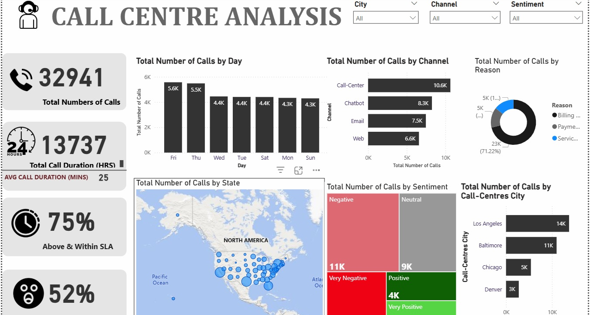
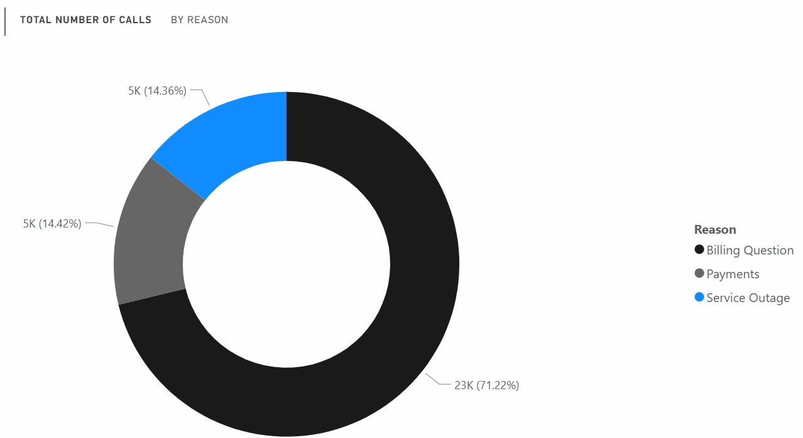

# Call Analysis
The primary objective of this project is to analyze call centre operations to identify key areas for improvement.
---

# Objectives
The primary objective of this project is to analyze call centre operations to identify key areas for improvement. The project aims to enhance efficiency and customer satisfaction by leveraging data analytics. Specific objectives include:

1.	Total Number of calls on each day over the specified period. 
2.	Geographical Analysis of received calls.
3.	Sentimental Analysis on calls. 
4.	Call Centre Breakdown 
5.	The top reasons for calls about inflows of calls 
6.	Channel breakdown and performance rating 
---

# Visualization 

---

# Executive Summary
This analysis evaluates call center performance across cities, communication channels, inquiry reasons, and geographic distribution. Key findings reveal significant disparities in call volumes, operational inefficiencies, and opportunities for process optimization. Strategic recommendations are provided to enhance customer experience and resource allocation.
---
# Call Center City Performance

Key Findings
 - Los Angeles dominated call volume with 13,734 calls, representing 41.69% of total calls.
 - Denver recorded the lowest volume (2,776 calls), 394.74% lower than Los Angeles.
 - Ranking: Los Angeles > Baltimore (6,422) > Chicago (5,198) > Denver (2,776).
 - Range: 2,776 (Denver) to 13,734 (Los Angeles).

# Call Distribution by Channel

Key Findings
Call centre was the most utilized channel (10,639 calls, 32.30% of total).
Web had the lowest engagement (6,576 calls), 61.79% lower than Call-Center.
Ranking: Call-Center > Chatbot (8,921) > Email (7,320) > Web (6,576).

# Call Reasons Analysis

Key Findings
Billing Questions drove 71.22% of total calls (23,462 calls).
Payments (4,749) and Service Outage (4,730) accounted for <15% combined.

# Geographic Distribution by State

Key Findings
California led with 3,631 calls (11.02% of total), 32,909.09% higher than Wyoming (11 calls).
Range: 11 (Wyoming) to 3,631 (California).
---
# Strategic Recommendations Summary
Prioritize Billing Resolution: Address root causes of billing inquiries to reduce 71% of call volume.
Optimize Digital Channels: Shift demand from call centers to self-service platforms.
Geographic Resource Alignment: Reallocate staff based on call density and regional needs.
Data-Driven Monitoring: Implement real-time dashboards to track call drivers and channel performance.
